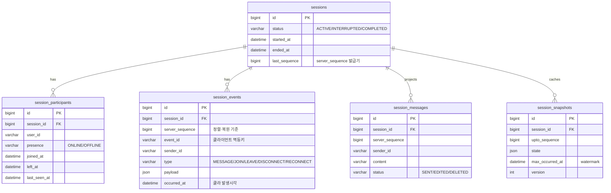

# rechat-backend — 1:1 실시간 채팅 및 이벤트 기반 상태 복원

1:1 실시간 채팅 서비스이자, 대화 중 발생한 모든 이벤트를 append-only 원장에 적재해 특정 시점의 대화 상태를 결정론적으로 복원하는 백엔드입니다. WebSocket(STOMP) 실시간 통신, Event Sourcing, Projection/Snapshot 복원을 실제 동작하는 코드로 구현했습니다.

문서 곳곳의 표기 — ✅ 는 동작하는 구현(+테스트), 📝 는 미구현이며 운영 적용 가능한 수준의 설계로 대체한 항목입니다.

---

## 목차
1. [기술 스택과 선택 근거](#1-기술-스택과-선택-근거)
2. [빠른 시작](#2-빠른-시작)
3. [동작 확인: 세션 생성부터 채팅까지](#3-동작-확인-세션-생성부터-채팅까지)
4. [구현 범위와 미구현 범위](#4-구현-범위와-미구현-범위)
5. [데이터 모델](#5-데이터-모델)
6. [API 요약](#6-api-요약)
7. [핵심 설계: 중복·순서·결정성](#7-핵심-설계-중복순서결정성)
8. [이벤트 기반 상태 복원](#8-이벤트-기반-상태-복원)
9. [재연결 시 데이터 정합성](#9-재연결-시-데이터-정합성)
10. [쿼리와 인덱스 최적화](#10-쿼리와-인덱스-최적화)
11. [비동기 처리 설계](#11-비동기-처리-설계)
12. [수평 확장 전략](#12-수평-확장-전략)
13. [관측 가능성 설계](#13-관측-가능성-설계)
14. [장애 대응 시나리오](#14-장애-대응-시나리오)

---

## 1. 기술 스택과 선택 근거

| 영역 | 선택 | 근거 |
|---|---|---|
| 언어/런타임 | Java 21 | record·패턴 매칭·가상 스레드 등 최신 기능, LTS |
| 프레임워크 | Spring Boot 3.5.4 | WebSocket/STOMP, JPA, Actuator를 한 생태계로 통합 |
| 실시간 | WebSocket + STOMP + SockJS | 구독/발행 메시징 시맨틱과 폴백(SockJS), 외부 브로커로 확장 용이 |
| 영속성 | Spring Data JPA + MySQL 8 | 강한 정합성과 Unique 제약으로 멱등성 백스톱 확보 |
| 마이그레이션 | Flyway | 스키마 버전 관리와 재현성. 스키마 소유권은 Flyway가 갖고 JPA는 validate만 |
| 문서화 | springdoc-openapi (Swagger UI) | 코드와 API 문서 동기화 |
| 관측 | Spring Boot Actuator + Micrometer | 헬스·메트릭 표준 노출 |
| 테스트 | JUnit5, Mockito, AssertJ, Testcontainers(MySQL) | 실제 MySQL로 인덱스·제약·동시성까지 검증 |

왜 WebSocket(STOMP)인가 — 1:1이라도 상대 메시지나 presence를 서버가 밀어줘야 해서 요청/응답만으로는 부족합니다. STOMP는 토픽 구독과 개인 큐(resume) 시맨틱을 표준으로 제공하므로, 수평 확장 시 외부 브로커(Redis, RabbitMQ)로 교체하기 쉽습니다. WebRTC는 P2P 미디어에 강점이 있지만 서버가 이벤트 원장을 보유해야 하는 이 과제(상태 복원)와는 결이 다릅니다.

## 디렉터리 구조

```
com.jnhro1.rechatbackend
├─ session/      세션 라이프사이클 (생성·조회·목록·종료)
├─ participant/  참여자와 presence (join/leave/disconnect/reconnect)
├─ event/        이벤트 원장과 메시지 projection (수집·조회)   └ message/
├─ restore/      상태 복원 (timeline + reducer)                └ snapshot/
├─ realtime/     WebSocket/STOMP (controller·broadcaster·presence)  └ config/
├─ user/         데모 유저 시드
├─ common/       응답 봉투·예외·BaseEntity·util
└─ config/       Async·Clock·Jpa·OpenAPI
```
의존 방향은 순환이 없습니다: participant → session, event → session·participant, restore → event, restore.snapshot → event·restore, realtime → event·participant.

---

## 2. 빠른 시작

사전 요구 사항
- Docker / Docker Compose (DB와 통합 테스트에 사용)
- 앱을 로컬에서 직접 실행한다면 JDK 21

전체 스택을 컨테이너로 (가장 간단)
```bash
docker compose up -d --build
# app: http://localhost:8080  /  mysql: localhost:3306
```
도커로 띄우면 `local` 프로파일이 자동 적용됩니다. 컨테이너에 주입된 `DB_URL`이 datasource를 덮어쓰므로 별도 설정이 필요 없습니다.

DB만 컨테이너로 띄우고 앱은 Gradle로
```bash
docker compose up -d mysql
SPRING_PROFILES_ACTIVE=local ./gradlew bootRun
```

확인 포인트

| 용도 | URL |
|---|---|
| Swagger UI (REST API) | http://localhost:8080/swagger-ui.html |
| Health | http://localhost:8080/actuator/health |
| WebSocket 테스트 클라이언트 | `docs/ws-playground.html` (브라우저로 열기) |

기동 시 `UserSeeder`가 데모 유저 alice/bob/carol을 멱등 시드합니다(로그인은 비목표라 userId만으로 식별).

테스트
```bash
./gradlew test             # 단위 테스트 (빠름, DB 불필요)
./gradlew integrationTest  # 통합/동시성/WS/스냅샷 (Testcontainers, Docker 필요)
```
통합 테스트는 Testcontainers로 실제 MySQL을 띄워 Flyway 마이그레이션, Hibernate validate, 인덱스·제약·동시성을 함께 검증합니다. 시각은 `Clock` 주입으로 고정해 결정론을 보장합니다.

---

## 3. 동작 확인: 세션 생성부터 채팅까지

Swagger와 WebSocket 클라이언트만으로 전체 흐름을 직접 재현할 수 있습니다. 앱을 띄운 뒤 아래 순서를 따르세요.

### 1) 세션 생성
Swagger UI에서 `POST /api/v1/sessions`를 실행하고 응답의 `data.id`를 확인합니다(이하 예시는 `1`).
```bash
curl -X POST localhost:8080/api/v1/sessions
```

### 2) 참여자 두 명 join
같은 세션에 alice, bob을 넣습니다. 1:1 정원이라 세 번째 참여는 409로 막힙니다.
```bash
curl -X POST localhost:8080/api/v1/sessions/1/join \
  -H 'Content-Type: application/json' -d '{"userId":"alice"}'

curl -X POST localhost:8080/api/v1/sessions/1/join \
  -H 'Content-Type: application/json' -d '{"userId":"bob"}'
```

### 3) 메시지 보내기 — 두 가지 방법 중 택1

방법 A. WebSocket (`docs/ws-playground.html`)

브라우저로 `docs/ws-playground.html`을 두 개 띄우고, 한쪽은 userId=alice, 다른 쪽은 bob, 둘 다 sessionId=1로 연결합니다. 연결하면 구독과 resume가 자동으로 수행됩니다. 한쪽에서 send를 누르면 다른 쪽에 실시간으로 도착합니다. 전송할 때마다 실제 STOMP 목적지와 payload가 로그에 함께 찍힙니다.

방법 B. REST (`POST /api/v1/sessions/{id}/events`)

REST로 수집한 메시지도 커밋 후 같은 토픽으로 브로드캐스트됩니다. ws-playground를 구독해 둔 상태에서 아래를 호출하면 실시간으로 함께 들어옵니다.
```bash
curl -X POST localhost:8080/api/v1/sessions/1/events \
  -H 'Content-Type: application/json' \
  -d '{
    "eventId": "11111111-1111-1111-1111-111111111111",
    "type": "MESSAGE",
    "senderId": "alice",
    "content": "안녕하세요",
    "occurredAt": "2026-06-30T09:00:00Z"
  }'
```
같은 `eventId`로 한 번 더 호출하면 새로 저장하지 않고 같은 `serverSequence`로 200을 반환합니다(멱등성 확인).

WebSocket과 REST의 메시지 필드 차이

| | WebSocket `/app/.../send` | REST `POST /events` |
|---|---|---|
| senderId | STOMP Principal에서 (본문에 없음) | 본문 필수 |
| type | 항상 MESSAGE라 생략 | `MESSAGE` 명시 |
| eventId | 생략 시 서버가 생성 | 필수 (멱등키) |
| 브로드캐스트 | 커밋 후 토픽 전파 | 동일하게 토픽 전파 |

### 4) 상태 복원
```bash
curl "localhost:8080/api/v1/sessions/1/timeline"                       # 현재 상태
curl "localhost:8080/api/v1/sessions/1/timeline?at=2026-06-30T09:00:00Z" # 과거 시점
```

---

## 4. 구현 범위와 미구현 범위

✅ 구현 (동작 + 테스트)
- 실시간 송수신(WebSocket/STOMP), join·leave·disconnect·reconnect 처리
- Presence(ONLINE/OFFLINE, 세션 참여 여부, 마지막 접속 시각)
- 이벤트 수집·저장·조회 API, 세션별 원장 적재
- 중복 처리 — eventId 멱등키, `(session_id, event_id)` Unique, 비관적 락 직렬화
- 순서 처리 — 서버 채번 server_sequence를 저장·전달·조회·복원에 일관 적용
- 상태 복원 — `GET /timeline?at=`. 현재 상태는 스냅샷 가속, 과거 시점은 스냅샷+watermark 가속에 full replay 폴백
- 스냅샷 자동 생성(@Async, interval 기반)과 동기 메시지 Projection
- Flyway 스키마, Actuator(health/metrics), Swagger, Testcontainers 통합 테스트

📝 설계로 대체 (미구현)
- 수평 확장 — 현재 단일 인스턴스 전제, Redis/Kafka 브로커 미도입 ([§12](#12-수평-확장-전략))
- 비동기 재시도·지수 백오프·DLQ·Outbox — 현재 스냅샷은 fire-and-forget @Async ([§11](#11-비동기-처리-설계))
- 분산 추적 — micrometer-tracing/OTel 미도입 ([§13](#13-관측-가능성-설계))
- 인증/인가 — 과제 비목표. 현재 userId만으로 식별하고 STOMP SUBSCRIBE 인가는 없음
- 메시지 수정/삭제 — EDIT/DELETE 이벤트 타입은 정의했으나 reducer는 아직 no-op

---

## 5. 데이터 모델

### 5.1 ERD


### 5.2 모델링 선택과 트레이드오프
- 단일 이벤트 테이블(session_events)에 타입별 가변 데이터는 JSON payload로 둡니다. 새 이벤트 타입을 추가해도 스키마를 바꿀 필요가 없고, 원장이 단일 진실 원천(SSOT)이라 정렬·복원 기준이 하나로 모입니다. 대신 payload는 DB 레벨 강타입 검증이 약해 애플리케이션(record DTO)에서 검증하며, 타입별 통계 쿼리는 JSON 추출 비용이 듭니다.
- Projection을 분리(session_participants, session_messages)해 원장에서 파생한 조회 모델을 둡니다. 현재 참여자나 최근 메시지 같은 핫패스 조회를 리플레이 없이 단순 SELECT로 처리하고, 필요하면 언제든 원장에서 재구축합니다. 대신 원장과 Projection을 이중 기록하므로 부분 실패 시 정합성 관리가 필요합니다 ([§14.3](#143-데이터-유실--정합성-이슈)).
- Snapshot(session_snapshots)은 특정 시퀀스까지 fold한 상태 캐시로, 복원 비용을 낮춥니다 ([§8](#8-이벤트-기반-상태-복원)).

### 5.3 Unique 제약과 인덱스
전체 DDL은 `src/main/resources/db/migration/V1__init.sql`에 있습니다.

| 테이블 | 키 | 목적 |
|---|---|---|
| session_events | UNIQUE `(session_id, event_id)` | 중복 이벤트 차단 (멱등키) |
| session_events | UNIQUE `(session_id, server_sequence)` | 시퀀스 무결성과 순차 조회/복원 핫패스 |
| session_events | `(session_id, occurred_at)` | 특정 시점 이전 이벤트 조회 |
| sessions | `(status, created_at)` / `(created_at)` | 세션 목록 (상태필터+정렬 / 기본정렬) |
| session_participants | UNIQUE `(session_id, user_id)` | 동일 사용자 중복 참여 차단 |
| session_messages | UNIQUE `(session_id, server_sequence)` | 메시지 식별과 멱등 Projection |
| session_snapshots | UNIQUE `(session_id, upto_sequence)` | 동일 지점 중복 스냅샷 방지 |
| session_snapshots | `(session_id, max_occurred_at)` | 과거 시점 복원 시 안전한 base 탐색 (watermark) |

---

## 6. API 요약

전체 명세와 요청/응답 예시, 오류 코드는 Swagger UI(`/swagger-ui.html`)에서 확인할 수 있습니다. 모든 응답은 `ApiResponse<T>` 봉투(data / error / timestamp)로 통일했습니다.

### REST
| Method | Path | 설명 |
|---|---|---|
| POST | `/api/v1/sessions` | 세션 생성 (ACTIVE) |
| GET | `/api/v1/sessions` | 목록 (상태/기간/참여자 필터, 정렬, Offset 페이지) |
| GET | `/api/v1/sessions/{id}` | 단건 조회 |
| POST | `/api/v1/sessions/{id}/join` | 참여 (JOIN 이벤트화, 정원 초과 시 409) |
| POST | `/api/v1/sessions/{id}/leave` | 퇴장 (LEAVE) |
| POST | `/api/v1/sessions/{id}/disconnect` | 연결 끊김 (DISCONNECT, 멤버십 유지) |
| POST | `/api/v1/sessions/{id}/reconnect` | 재연결 (RECONNECT) |
| POST | `/api/v1/sessions/{id}/end` | 종료 (COMPLETED, 참여자 OFFLINE) |
| POST | `/api/v1/sessions/{id}/events` | 이벤트(MESSAGE) 수집 — 신규 201 / 중복 200 |
| GET | `/api/v1/sessions/{id}/events?from=&to=&limit=` | 구간 이벤트 조회 (디버깅·검증·리플레이) |
| GET | `/api/v1/sessions/{id}/timeline?at=&messageLimit=` | 특정 시점 상태 복원 |

### WebSocket (STOMP, endpoint `/ws-chat`, SockJS)
- CONNECT 헤더의 userId로 Principal을 식별합니다(인증 비목표).
- 구독: `/topic/sessions/{id}` 확정 이벤트 브로드캐스트, `/user/queue/sessions/{id}` resume 개인 큐, `/user/queue/errors` 오류.
- 송신: `/app/sessions/{id}/send` `{eventId, content, occurredAt}` → 이벤트 수집 후 커밋되면 토픽으로 브로드캐스트.
- 재개: `/app/sessions/{id}/resume` `{afterSequence}` → 누락 이벤트를 개인 큐로 리플레이.

---

## 7. 핵심 설계: 중복·순서·결정성

### 7.1 중복 이벤트 식별과 처리
식별 기준은 클라이언트가 생성한 eventId(UUID)입니다. 같은 eventId 재전송은 같은 이벤트로 봅니다.

세 겹으로 막습니다.
1. 앱 레벨 — `SessionEventAppender`가 저장 전 `findBySessionIdAndEventId`로 검사하고, 이미 있으면 기존 이벤트를 그대로 반환합니다(created=false).
2. DB 레벨 — `(session_id, event_id)` Unique가 경쟁 조건의 최종 백스톱입니다.
3. 동시성 — 세션 행 비관적 락(`findByIdForUpdate`)으로 멱등 검사와 채번을 직렬화합니다.

재요청 응답은 REST 기준 신규 201, 중복 200으로 구분하되 body는 같은 이벤트입니다. 복원 단계에서도 원장에 중복이 없고 Projection이 `(session_id, server_sequence)` Unique라 리플레이와 스냅샷이 자동으로 멱등합니다.

검증: `concurrent_sameEventId_storesOnce`(5건 동시 → 1건 저장), `collect_duplicate_isIdempotent`.

### 7.2 순서 기준은 server_sequence
서버가 수신 순서대로 채번하는 세션 내 단조 증가 번호입니다(`Session.allocateSequence()`, 락 안에서 호출). 이 단일 기준을 저장, 실시간 전달, 이벤트 조회, Projection, 상태 복원 전 영역에 일관되게 적용합니다.

도착 순서가 뒤바뀌어도 서버 수신 순으로 정렬하므로, 같은 이벤트 집합은 항상 같은 상태로 복원됩니다. occurred_at은 과거 복원의 시간 컷 필터로만 쓰고 정렬과 동순위 처리는 언제나 server_sequence를 따릅니다.

검증: `ordering_followsArrivalNotOccurredAt`.

---

## 8. 이벤트 기반 상태 복원

### 8.1 복원 대상 상태
특정 시점 t를 기준으로 참여자 상태(목록, 입장/퇴장, presence)와 메시지 상태(그 시점까지 표시될 메시지, 최근 N개, 정렬)를 복원합니다. join/leave/disconnect/reconnect/message를 반영합니다.

### 8.2 Replay 전략 (하이브리드)
라이브·복원·스냅샷이 같은 `SessionStateReducer`를 써서 동일한 fold 규칙을 공유합니다(결정성).

| 요청 | 전략 |
|---|---|
| 현재 상태 (at 생략) | 최신 스냅샷을 base로 그 이후 이벤트만 증분 리플레이 |
| 과거 시점 (at=T) | watermark(max_occurred_at) ≤ T 인 가장 진행된 스냅샷을 base로 이후만 보정 리플레이, 안전한 스냅샷이 없으면 full replay 폴백 |

### 8.3 watermark — occurred_at과 server_sequence 축 불일치 해결
스냅샷은 server_sequence 축으로 만들어지고 과거 복원은 occurred_at 축으로 자릅니다. 순서가 역전되면 두 축이 어긋납니다.
```
seq1 occurred 10:00 / seq2 occurred 09:00 (늦게 도착)
스냅샷 upto=2 = fold{seq1, seq2} 인데 seq1은 10:00 발생
→ at=09:30 복원에 base로 쓰면 아직 발생하지 않은 seq1이 섞여 오염
```
해법으로 각 스냅샷에 자신이 커버한 이벤트의 최대 occurred_at(watermark)을 저장합니다. 과거 복원 시 watermark ≤ T 인 스냅샷만 base로 채택하면, base가 fold한 모든 이벤트가 시점 T에 이미 발생했음이 보장됩니다. watermark는 upto_sequence에 대해 단조 비감소라 watermark ≤ T 중 가장 큰 upto_sequence가 항상 최적 base이고, full replay와 결과가 동일함을 증명할 수 있습니다.

검증: `pastTimeSnapshotAccelerated_equalsFullReplay`(순서 역전 포함, 가속과 full replay 결과 동일), `pastTime_skipsSnapshot_whenWatermarkExceedsAt`(미래 발생 이벤트가 새지 않음).

### 8.4 복원 로직에서의 중복·순서 처리
- 중복은 저장 단계에서 이미 차단되어 원장에 없으므로 리플레이가 추가로 제거할 필요가 없습니다. Projection도 시퀀스 Unique로 멱등합니다.
- 순서는 복원 쿼리가 항상 `ORDER BY server_sequence ASC`라 같은 데이터를 반복 복원하면 같은 결과가 나옵니다.

### 8.5 복원 비용과 성능
- 인덱스: 순차 조회 `(session_id, server_sequence)`, 시점 컷 `(session_id, occurred_at)`, 스냅샷 base `(session_id, max_occurred_at)`.
- 스냅샷 주기는 `snapshot.interval`(기본 50이나 테스트 편의를 위해 Local에서 3으로 설정). 작을수록 리플레이 길이는 줄고 저장량은 늘어나는 트레이드오프입니다.
- 저장 포맷은 JSON이며 참여자는 전량, 메시지는 최근 200개로 절단(`SNAPSHOT_MESSAGE_LIMIT`)해 스냅샷 크기를 제한합니다.
- 데이터가 커져도 리플레이 길이는 최악 interval로 묶입니다. 이벤트가 수억 건이 되면 session_events 파티셔닝/아카이빙을 고려합니다 ([§10](#10-쿼리와-인덱스-최적화)).
- 트레이드오프(미구현): 오래된 스냅샷 정리(retention)는 없어 누적됩니다. 운영에서는 최신 K개만 유지하고 아카이빙하는 방식을 권장합니다.

---

## 9. 재연결 시 데이터 정합성

resume과 presence는 동작하며, 운영 강화 항목은 설계로 남겨 둡니다.

- 마지막 수신 이후 재전송 — 클라이언트는 마지막으로 받은 server_sequence(lastSeq)를 보관합니다. 재연결하면 토픽을 다시 구독한 뒤 `/app/sessions/{id}/resume {afterSequence: lastSeq}`를 보내고, 서버는 `getEventsAfter`로 누락분만 개인 큐로 리플레이합니다(커서 기반이라 빠진 구간만 정확히 재전송).
- 누락 이벤트 조회 — REST `GET /events?from=&to=`로도 검증하거나 보정할 수 있습니다.
- 중복 수신 방지 — 재구독과 resume 사이에 토픽 재방송과 resume이 겹칠 수 있어, 클라이언트가 eventId로 중복을 거릅니다(이미 본 시퀀스는 무시). `docs/ws-playground.html`에 자동 재연결과 dedup 루틴이 들어 있습니다.
- Presence 정합성 — `WebSocketSessionRegistry`가 stompSessionId를 (userId, sessionId)에 매핑합니다. CONNECT 시 ONLINE, DISCONNECT 이벤트 시 OFFLINE로 멱등 전이하며, presence 전이가 항상 이벤트화되어 복원 결과와 일치합니다.
- 운영 강화(설계) — 서버 측 커서(참여자별 마지막 ack 시퀀스)를 저장하면 클라 상태가 유실돼도 서버가 재전송 시작점을 판단할 수 있습니다. 지금은 서버를 무상태로 두려고 클라 커서 방식을 택했습니다.

---

## 10. 쿼리와 인덱스 최적화

대화 데이터가 대량으로 쌓일 때의 조회 성능 전략입니다. 핫패스 세 가지를 다룹니다.

### 쿼리 1 — 세션 이벤트 순차 조회 / WS resume
```sql
SELECT * FROM session_events
WHERE session_id = ? AND server_sequence > ?
ORDER BY server_sequence ASC
LIMIT ?;
```
- 인덱스: UNIQUE `(session_id, server_sequence)`. 선두 session_id 등치와 server_sequence 범위/정렬을 한 인덱스로 처리해 filesort가 없습니다.
- 페이지네이션: afterSequence 커서(keyset)라 Offset처럼 깊어질수록 느려지지 않습니다.
- 병목과 개선: 한 세션 이벤트가 수억 건이면 b-tree 깊이와 핫 파티션이 문제가 됩니다. session_id 해시 파티셔닝이나 오래된 이벤트 아카이브 테이블 분리를 고려합니다.

### 쿼리 2 — 특정 시점 이전 이벤트 (과거 복원)
```sql
SELECT * FROM session_events
WHERE session_id = ? AND occurred_at <= ?
ORDER BY server_sequence ASC;
```
- 인덱스: `(session_id, occurred_at)`로 시점 컷 범위를 좁힙니다. 정렬 키(server_sequence)가 인덱스와 달라 정렬 비용이 있으나, 스냅샷+watermark 가속으로 실제 스캔 행 수를 interval 수준으로 줄입니다([§8.3](#83-watermark--occurred_at과-server_sequence-축-불일치-해결)). 가속 경로의 쿼리는 `WHERE session_id=? AND server_sequence > base AND occurred_at <= ? ORDER BY server_sequence`로 쿼리 1의 시퀀스 인덱스를 타고 occurred_at은 잔여 필터가 됩니다.
- 병목과 개선: 가속이 안 되는 이른 시점은 풀 스캔이라, 스냅샷 주기를 줄이거나 시점→시퀀스 매핑을 캐시합니다.

### 쿼리 3 — 세션 목록 조회
```sql
SELECT * FROM sessions
WHERE status = ? AND created_at BETWEEN ? AND ?
ORDER BY created_at DESC
LIMIT ?;
```
- 인덱스: `(status, created_at)`로 등치(status) 후 범위/정렬(created_at)을 한 인덱스에서 처리합니다. status 필터가 없는 기본 목록은 `(created_at)` 단일 인덱스로 정렬을 충족합니다(복합 인덱스는 선두 컬럼이 조건에 없으면 정렬에 못 씁니다).
- 페이지네이션: 목록 특성상 Offset을 택해 총 개수와 페이지 점프를 제공합니다. 깊은 페이지에서 느려지는 트레이드오프가 있어, 무한 스크롤로 가면 `(created_at, id)` 커서로 교체할 수 있습니다.
- 병목과 개선: 세션 수가 급증하면 status 카디널리티 편향이 생겨 커버링 인덱스나 요약 테이블을 검토합니다.

---

## 11. 비동기 처리 설계

### 11.1 현재 구조 (✅ 구현)
```
이벤트 수집 (@Transactional)
   ├─ 원장 저장 + Projection(session_messages) 동기 기록   ← 같은 트랜잭션 (강정합)
   └─ SessionEventAppended 발행
          ├─ [AFTER_COMMIT, 동기] SessionEventBroadcaster → STOMP 토픽 브로드캐스트
          └─ [AFTER_COMMIT, @Async] SessionSnapshotScheduler → interval 배수면 스냅샷 생성
```
- 메시지 Projection은 수집 트랜잭션 안에서 동기로 기록해 즉시 일관성을 보장하고, 스냅샷만 비동기(전용 풀 snapshot-, core 2 / max 4 / queue 100)로 떼어내 수집 지연을 줄입니다.
- 브로드캐스트와 스냅샷 모두 커밋 후에만 실행해, 저장되지 않은 이벤트가 노출되는 부분 실패를 막습니다.
- 스냅샷 생성은 `(session_id, upto_sequence)` Unique와 동시 생성 시 `DataIntegrityViolation` 무시로 멱등하며 중복 실행을 방지합니다.

### 11.2 운영 설계 — 미구현, 브로커 도입 시
```
API/WS → Event Store → (Outbox) → Message Broker (Kafka / Redis Streams)
                                      ├─ Projection Worker
                                      └─ Snapshot Worker
```
- Outbox 패턴 — 이벤트 저장과 같은 트랜잭션에 outbox 행을 남기고 별도 릴레이가 브로커로 발행해, Event Store 저장과 발행 사이의 부분 실패를 없앱니다.
- 재시도 — 지수 백오프(예: 1s, 2s, 4s … 최대 N회) 후 초과하면 DLQ로 격리하고 알립니다.
- 멱등성과 중복 실행 방지 — 컨슈머는 `(session_id, server_sequence)`로 멱등 upsert하고 마지막 처리 시퀀스(offset)를 저장해 재처리 시 이미 반영된 분을 건너뜁니다.
- 순서 보장 — session_id를 파티션 키로 삼아 세션 내 순서를 유지합니다.
- 복구 — 워커 장애 시 마지막 처리 시퀀스부터 재개하고 Consumer Lag를 모니터링합니다.

---

## 12. 수평 확장 전략

현재는 단일 인스턴스 전제이며, 다중 인스턴스로 가는 설계입니다.

- 세션 상태 외부화 — 인메모리 `WebSocketSessionRegistry`(presence)는 인스턴스 로컬이라 다중 인스턴스에선 Redis로 옮깁니다(presence와 라우팅 테이블). 진실 원천인 이벤트와 Projection은 이미 DB에 있어 무상태 확장에 유리합니다.
- 메시지 전파 — STOMP SimpleBroker를 외부 브로커(Redis Pub/Sub, RabbitMQ STOMP relay)로 교체하면, A 인스턴스가 받은 메시지가 B 인스턴스에 붙은 상대에게 전달됩니다.
- WebSocket 라우팅과 Sticky Session — WS는 롱커넥션이라 LB에서 sticky(예: ip-hash)가 편합니다. 다만 sticky는 부하 편중과 재배치가 어려운 단점이 있어, 외부 브로커로 인스턴스 간 전파를 보장하면 sticky 의존도를 낮출 수 있습니다.
- 재연결 라우팅 — 인스턴스 장애로 끊긴 클라가 다른 인스턴스로 재접속해도 afterSequence 커서 기반 resume으로 누락을 복구하므로([§9](#9-재연결-시-데이터-정합성)), 어느 인스턴스에 붙든 정합성이 유지됩니다.
- 세션 분산 — session_id 기준 일관 해싱으로 처리 주체를 분산하고, 브로커 파티션 키와 일치시켜 순서를 보장합니다.

### Redis 선행 멱등성 체크 (📝)
지금은 이벤트 수집마다 DB에서 `findBySessionIdAndEventId`로 중복을 확인하고 `(session_id, event_id)` Unique로 막습니다. 인스턴스가 늘고 재전송이 잦아지면 이 조회가 DB I/O 핫스팟이 될 수 있어, 공유 Redis를 앞단 캐시로 두는 설계입니다.

- 동작 — 수집 시 먼저 `SETNX idem:{sessionId}:{eventId}`(TTL 부여)를 시도합니다. 키가 이미 있으면 중복으로 보고 DB를 거치지 않고 바로 막거나 캐시된 응답을 돌려줍니다. 키 선점에 성공하면 신규로 보고 DB 적재로 진행합니다. 인스턴스들이 같은 Redis를 보므로 DB 도달 전에 인스턴스 간 중복까지 걸러집니다.
- 중복 응답 재사용 — 커밋 성공 후 `eventId → 결과(serverSequence 등)`를 Redis에 TTL과 함께 적재해 두면, 같은 eventId 재요청은 DB 없이 동일 응답을 즉시 반환합니다(명세의 중복 응답 재사용).
- 정확성은 DB가 보증 — Redis는 빠른 경로일 뿐 진실 원천이 아닙니다. 만료·미스·장애가 있을 수 있으므로 `(session_id, event_id)` Unique 제약을 그대로 유지해 최종 멱등성을 보장합니다. DB 적재가 실패/롤백되면 선점한 Redis 키를 되돌려, 저장되지 않은 이벤트가 중복으로 오인되지 않게 합니다.
- 트레이드오프 — DB 조회를 줄여 지연과 부하를 낮추지만 Redis 의존이 늘고 캐시 일관성 관리(TTL, 롤백 보상)가 따라옵니다. Redis 장애 시에는 DB 단독 경로(현재 방식)로 자연히 폴백됩니다.

---

## 13. 관측 가능성 설계

### 현재 (✅)
- 로그 — SLF4J/Logback. sessionId, eventId, server_sequence 같은 도메인 식별자를 로그에 포함해 추적 단서를 남기고, WS 예외는 `@MessageExceptionHandler`에서 모읍니다.
- 메트릭 — Actuator로 health, info, metrics를 노출합니다. Micrometer가 JVM, HikariCP(커넥션 풀), HTTP, Tomcat 메트릭을 자동 수집합니다.
- 헬스 — `/actuator/health`(DB, 디스크 등)로 LB나 오케스트레이터의 헬스체크에 대응합니다.

### 운영 강화 (📝)
- 메트릭 시각화 — `micrometer-registry-prometheus`를 추가하면(설정에는 prometheus 노출이 이미 포함) Prometheus로 스크랩하고 Grafana로 수집 TPS, 복원 지연, 스냅샷 생성 시간, Consumer Lag를 봅니다.
- 분산 추적 — micrometer-tracing에 OTel/Zipkin 브리지를 붙여 요청·이벤트·WS 세션을 잇는 Correlation/Trace ID를 도입합니다. 도메인 차원에서는 eventId가 이미 end-to-end 상관키 역할을 합니다.
- 알림 기준(예) — 수집 에러율 1% 초과, 복원 p99 임계 초과, 스냅샷 실패, 커넥션 풀 사용률 90% 초과, DLQ 적재.

---

## 14. 장애 대응 시나리오

감지 → 완화 → 복구 순으로 정리합니다.

### 14.1 서버 다운 / 인스턴스 장애
- 감지 — `/actuator/health` 실패, WS 연결 종료 급증, 요청 실패율·응답시간 상승, 비정상 종료 로그.
- 완화 — LB 헬스체크로 장애 인스턴스를 빼고 신규 연결을 정상 인스턴스로 유도, 클라이언트는 자동 재연결.
- 복구 — 인스턴스를 재시작/교체하면 재연결한 클라가 마지막 server_sequence로 resume해 누락을 Replay하고 presence를 보정합니다. 진실 원천이 DB라 인스턴스 상태 유실이 데이터 유실로 이어지지 않고, 장애 구간 정합성은 원장 기준으로 검증합니다.

### 14.2 DB 장애 / 성능 저하 (커넥션 고갈, 락 경합, Slow Query)
- 감지 — Hikari 풀 사용률·대기 시간, 쿼리 응답시간, 타임아웃 비율, Deadlock/Lock Wait, DB CPU·I/O.
- 완화 — 커넥션 타임아웃 단축(connection-timeout=3000)으로 빠르게 실패시키고, 비필수 조회를 제한하며, 도입 시 Circuit Breaker, 읽기 트래픽 Replica 분리, 문제 쿼리 차단.
- 복구 — 풀 크기와 타임아웃 재조정, 인덱스 추가/변경, 트랜잭션 범위 축소(세션 락 보유 구간 최소화), 장기 쿼리 종료, Failover. 이 설계는 락을 세션 행에만 짧게 잡고 채번과 멱등 검사만 직렬화해 경합을 국소화했습니다.

### 14.3 데이터 유실 / 정합성 이슈
- 감지 — Unique 충돌 로그, 이벤트 수와 Projection 수 불일치, 마지막 처리 시퀀스 지연, 스냅샷 버전 불일치, 정합성 검증 배치.
- 완화 — 중복은 멱등키로 무시하고 기존 결과를 반환, 문제 세션 격리, Projection이 의심되면 스냅샷 사용을 멈추고 원장 기준으로 조회를 보정.
- 복구 — 원장이 SSOT라 Event Store 기반으로 Projection을 재구축하고 스냅샷을 재생성, 누락 이벤트 재처리, 중복 데이터 정리, 재발 방지용 제약과 모니터링을 추가합니다. 원장과 발행 사이의 부분 실패는 운영에서 Outbox로 원천 차단합니다([§11.2](#112-운영-설계--미구현-브로커-도입-시)).


